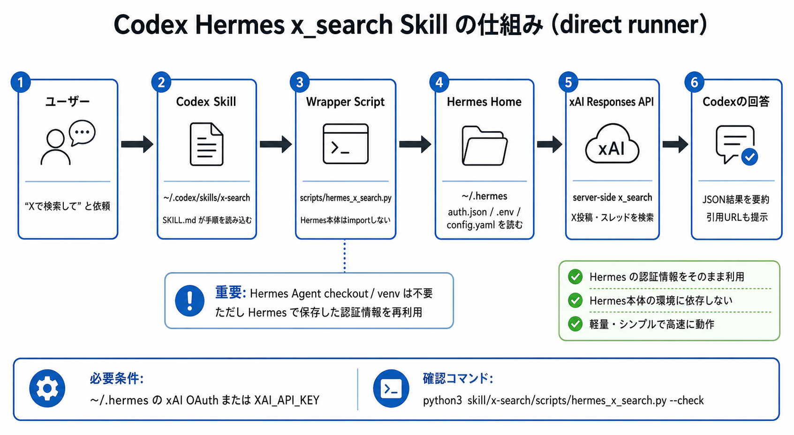

# Codex Hermes x_search Skill

CodexからxAI Responses APIの`x_search`ツールを呼び出すためのローカルスキルです。

Codexに新しいネイティブツールを追加するものではありません。Codexの`terminal`経由で、Hermes Agentが保存した`~/.hermes`配下の設定・認証情報を読み、xAI Responses APIの`x_search`ツールを直接呼び出します。



このリポジトリは、Hermes Agentで保存したxAI認証情報と`x_search`設定をCodexから再利用するための補助ツールです。Hermes Agent側のセットアップ背景やX Premiumでの認証手順については、次の記事も参考になります。

- [XプレミアムプランでGrokとx_searchツールを使う](https://zenn.dev/robustonian/articles/x_premium_grok_search)

## できること

- X / Twitter上の投稿、スレッド、反応を検索する
- 特定のXハンドルに絞って検索する
- 特定のXハンドルを除外して検索する
- 日付範囲を指定して検索する
- Hermes側のxAI OAuthまたは`XAI_API_KEY`を使って認証する
- 検索結果をJSONで受け取り、Codexが要約や引用URL提示に使う

## できないこと

- Codexのネイティブツール一覧に`x_search`を直接追加する
- xAI認証情報なしで単独動作する
- xAI認証なしでX検索を実行する
- X以外の一般Webページを検索する

一般Web検索にはCodex標準のWeb検索やHermesの`web` toolsetを使ってください。

## 仕組み

このリポジトリは、人間向けの説明とエージェント向けスキル本体を分けています。

```text
codex-hermes-x-search-skill/
├── README.md
├── assets/
│   └── architecture.png
└── skill/
    └── x-search/
        ├── SKILL.md
        ├── agents/
        │   └── openai.yaml
        └── scripts/
            └── hermes_x_search.py
```

`skill/x-search/` の中身はCodexエージェント向けです。人間向けのREADMEや図解はスキルフォルダの外に置いています。

インストール後のCodex skillsディレクトリは次の形になります。

```text
~/.codex/skills/x-search/
├── SKILL.md
├── agents/
│   └── openai.yaml
└── scripts/
    └── hermes_x_search.py
```

処理の流れは次の通りです。

1. ユーザーが「Xで検索して」「Twitterの反応を調べて」と依頼する
2. Codexが`x-search`スキルを読み込む
3. Codexが`terminal`で`scripts/hermes_x_search.py`を実行する
4. wrapper scriptが`~/.hermes/auth.json`、`~/.hermes/.env`、`~/.hermes/config.yaml`を読む
5. xAI OAuthまたは`XAI_API_KEY`でxAI Responses APIの`x_search`を直接実行する
6. 結果JSONをCodexが読み、要約して回答する

## 必要条件

- Codexが動くローカル環境
- xAI認証情報のどちらか
  - `hermes auth add xai-oauth`で保存したxAI OAuth
  - `~/.hermes/.env`または環境変数の`XAI_API_KEY`

## 導入方法

このリポジトリを任意の場所にcloneします。

```bash
git clone https://github.com/robustonian/codex-hermes-x-search-skill.git codex-hermes-x-search-skill
cd codex-hermes-x-search-skill
```

スキル本体だけをCodexのskillsディレクトリへ配置します。

```bash
mkdir -p ~/.codex/skills
cp -R skill/x-search ~/.codex/skills/x-search
```

既存ディレクトリを更新する場合:

```bash
cd codex-hermes-x-search-skill
git pull
rm -rf ~/.codex/skills/x-search
cp -R skill/x-search ~/.codex/skills/x-search
```

Codexを起動し直すと、スキル一覧に`x-search`が読み込まれます。

## 動作確認

まずは認証と設定状態を確認します。

以下の例では`python3`を使っています。環境によってはPython 3の実行コマンドが`python`の場合もあるため、
`python3`が存在しない場合は`python`に置き換えてください。

```bash
python3 skill/x-search/scripts/hermes_x_search.py --check
```

成功例:

```json
{
  "success": true,
  "registered": true,
  "toolset": "x_search",
  "requirements_ok": true,
  "credential_source": "xai-oauth",
  "runner": "direct",
  "model": "grok-4.3",
  "timeout_seconds": 180,
  "retries": 2,
  "hermes_home": "~/.hermes"
}
```

`requirements_ok`が`false`の場合は、wrapper scriptから利用可能なxAI認証情報が見えていません。
Hermes側で`hermes auth add xai-oauth`を実行済みか、`~/.hermes/.env`または環境変数に`XAI_API_KEY`があるかを確認してください。

## 使い方

基本検索:

```bash
python3 skill/x-search/scripts/hermes_x_search.py \
  --query "latest reactions to Grok on X"
```

特定ハンドルに絞る:

```bash
python3 skill/x-search/scripts/hermes_x_search.py \
  --query "latest post from xAI" \
  --allowed-handle xai
```

特定ハンドルを除外する:

```bash
python3 skill/x-search/scripts/hermes_x_search.py \
  --query "discussion about Grok" \
  --excluded-handle xai
```

日付範囲を指定する:

```bash
python3 skill/x-search/scripts/hermes_x_search.py \
  --query "OpenAI Codex reactions" \
  --from-date 2026-05-01 \
  --to-date 2026-05-18
```

画像・動画理解を有効にする:

```bash
python3 skill/x-search/scripts/hermes_x_search.py \
  --query "posts showing Grok image examples" \
  --image-understanding
```

```bash
python3 skill/x-search/scripts/hermes_x_search.py \
  --query "videos about Grok launch reactions" \
  --video-understanding
```

## 出力形式

検索結果はJSONです。

```json
{
  "success": true,
  "provider": "xai",
  "credential_source": "xai-oauth",
  "tool": "x_search",
  "runner": "direct",
  "model": "grok-4.3",
  "query": "latest post from xAI",
  "answer": "...",
  "citations": [],
  "inline_citations": [
    {
      "url": "https://x.com/xai/status/...",
      "title": "1",
      "start_index": 92,
      "end_index": 143
    }
  ]
}
```

Codexは主に`answer`を要約し、`citations`または`inline_citations`にURLがあれば引用元として提示します。

## 設定

wrapper scriptはデフォルトで次のパスを使います。

```text
Hermes home: ~/.hermes
```

別のHermes homeを使う場合:

```bash
python3 skill/x-search/scripts/hermes_x_search.py \
  --hermes-home /path/to/.hermes \
  --check
```

検索モデル、リトライ、タイムアウトはHermes側の設定を使います。

```yaml
x_search:
  model: grok-4.3
  timeout_seconds: 180
  retries: 2
```

## トラブルシュート

### `requirements_ok`が`false`

wrapper scriptから利用可能なxAI認証情報が見えていません。

確認するもの:

- `hermes auth add xai-oauth`を実行済みか
- `~/.hermes/.env`に`XAI_API_KEY`があるか
- `--check`の`hermes_home`が普段のHermes環境と一致しているか

### `NameResolutionError` / `Failed to resolve 'api.x.ai'`

Codexの実行環境から`api.x.ai`へ到達できない状態です。Codexのネットワーク権限やDNS設定を確認してください。
認証やHermes側の`x_search`登録が正しくても、この状態では検索リクエストは失敗します。

### 検索が遅い

`x_search`はxAI Responses APIのserver-side検索を使うため、通常のWeb検索より時間がかかることがあります。Hermes側の`x_search.timeout_seconds`で調整できます。

### Codexがスキルを認識しない

配置先が`~/.codex/skills/x-search`になっているか確認し、Codexを再起動してください。

## 関連記事

Hermes Agent側で`x_search`を使えるようにするまでの実体験ベースの手順は、以下の記事にまとまっています。

- [XプレミアムプランでGrokとx_searchツールを使う](https://zenn.dev/robustonian/articles/x_premium_grok_search)

記事では、Hermes Agentの導入、`hermes tools`での`x_search`有効化、xAI OAuth認証、リモート環境でのSSHポートフォワード、Grokモデル選択、`x_search`でできること・できないことが説明されています。

このスキルは、その記事で整えたHermes Agentの認証・設定をCodexから再利用するための薄いbridgeです。

## ライセンス

このリポジトリの独自コードとドキュメントはMIT Licenseです。詳細は[LICENSE](LICENSE)を参照してください。

Hermes Agent本体はこのリポジトリには含めていません。実行時にはHermes Agentが作成した`~/.hermes`配下の設定・認証情報を読みます。Hermes Agentは、確認時点ではNous ResearchのMIT Licenseで配布されています。公開する場合でも、このリポジトリがHermes Agent本体のコードを再配布していない限り、通常はHermes Agent側の著作権表示を同梱する必要は薄い構成です。

このラッパーは、Hermes Agentの認証ストアと連携するために必要な最小限のxAI `x_search` / OAuth処理を再実装しています。Hermes Agent本体とは別プロジェクトであり、Hermes Agentのコードを同梱・再配布するものではありません。xAI OAuthの`client_id`はOAuth PKCE用のpublic client idであり、Hermes Agentの公開ソースにも含まれている値です。これはAPIキーやclient secretではありません。

ただし、Hermes Agentのコードをこのリポジトリへコピーしたり、改変版を同梱したりする場合は、Hermes Agent側のLICENSEを保持してください。また、xAI/Xの利用条件や認証情報の扱いは別問題なので、APIキー、OAuthトークン、`~/.hermes/auth.json`、`.env`などは絶対にコミットしないでください。

このリポジトリは公開用に、Hermes Agent本体コード、APIキー、OAuthトークン、個人環境の絶対パスを含めない構成にしています。
